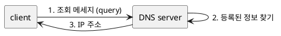

# 1. DNS 서버의 기본 동작

한줄 요약 : 클라이언트에서 조회메시지를 받고, 조회의 내용에 응답하는 형태로 정보를 회답하는일

조회 메세지 내용: 
이름 - url
클래스 : 항상 IN (예전에는 인터넷 외의 네트워크 선택지가 있엇으나 지금은 없어서 항상 IN)
타입: 어떤 타입의 정보인지, A이면 IP주소, MX이면 메일배송 지원지

예시)
1) github.com
2) IN
3) A

이런식으로 조회메세지를 DNS서버에 보내는 것임.
그러면, 1),2),3)에 맞는 리소스 레코드를 찾아서 해당 url을 찾아서 응답한다.

주석: A = address, MX = mail exchange
리소스 레코드는  1)2)3) + url의 정보묶음이다.

더 참고해보면 좋은 글:
https://steady-coding.tistory.com/523
http://www.ktword.co.kr/test/view/view.php?m_temp1=2110

# 2. 도메인의 계층

한줄요약: 정보를 분산시켜서 다수의 DNS서버에 등록, 다수의 서버가 연대하여 어디에 정보가 등록되어있는지를 찾아냄. 이때 계층화된 구조임.

www.github.com에서

com이 제일 상위 계층 도메인
--> github그 하위 도메인
--> www를 찾음

# 3. 담당 DNS 서버를 찾아 IP 주소를 가져온다

책 78페이지 볼것.
추후 plant uml로 보충할 것.

# 4. DNS 서버는 캐시 기능으로 빠르게 회답할 수 있다.

캐시써서 빨리 회신한다.
그런데 틀린정보일 수 있으니, 유효기간을 설정하고 회답할때 이게캐시에서 온건지 아닌지 정보를 같이 준다.
